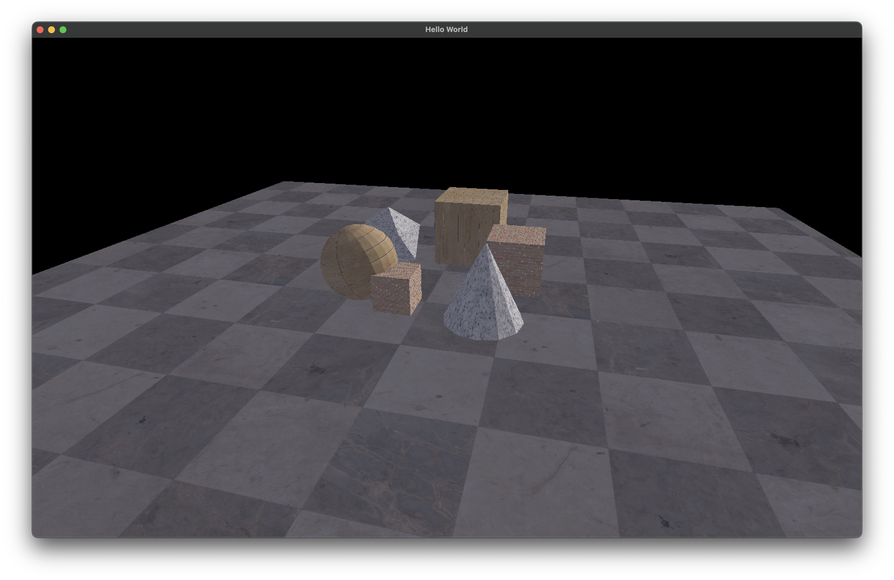

# Loonar engine
Loonar is a game engine written in C++. It uses sol2 behind the scenes to provide a Lua interface. It is a feat of engineering that is rarely seen these days. 

# Features
✅ - Implemented
⬇️ - In progress
❌ - Not implemented

## Lua Features
|Feature|Status|
|-------|------|
| Primitives | ✅ |
| Camera | ⬇️ |
| Material | ✅ |
| Mesh | ✅ |
| Events | ✅ |
| Scene Importing | ❌ |
| Hot Reload | ❌ |

## C++ Features
|Feature|Status|
|-------|------|
| Deferred rendering | ✅ |
| Physics (Jolt) | ✅ |
| Asset management | ✅ |
| Scene management | ✅ |
| Lua Scripts | ✅ |
| UI | ❌ |


# Specification

[Here](./spec.md)

# Build

```bash
git clone https://github.com/IndaPlus24/ollebjor-osen-project.git
cd ollebjor-osen-project
cmake -Wno-dev -DCMAKE_BUILD_TYPE=Release -DCMAKE_POLICY_VERSION_MINIMUM=3.5 -B build
# Linux/OSX
cmake --build build
# Or Windows
cmake --build build --config Release
```

# Usage

```bash
# Unix
./build/Loonar <scripts...>
# Windows
start build\Release\Loonar.exe <scripts...>
```

# Example




